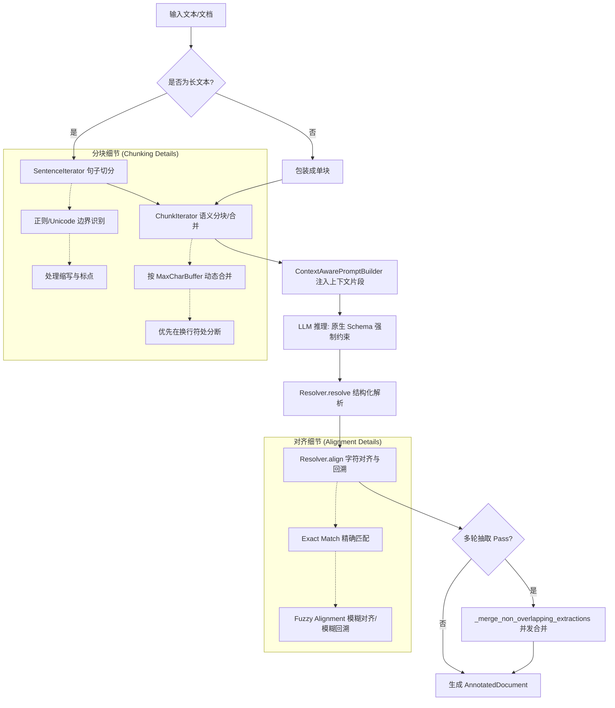
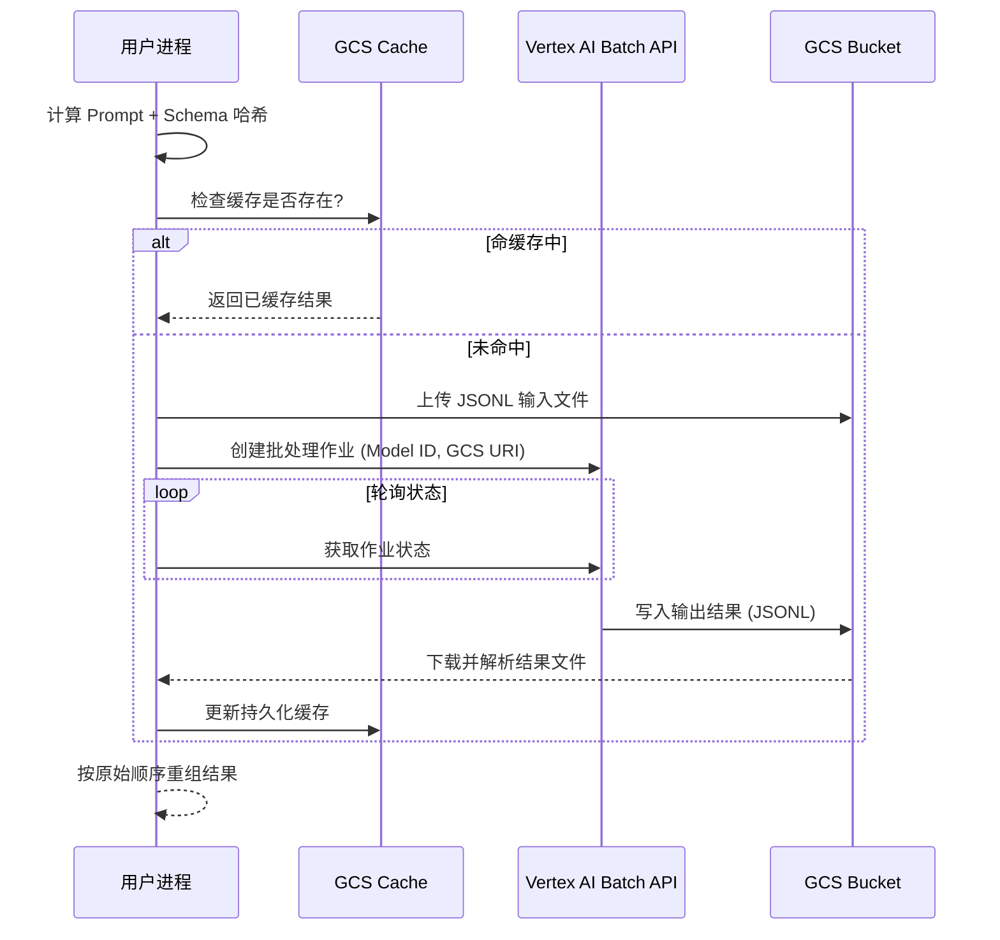

# LangExtract: 高效抽取原理与高质量输出深度分析

zwy结论: 可以参考他的实现方式，但是需要针对特定项目做比较大的修改.

本文档旨在分析 `LangExtract` 项目实现高效抽取、高质量输出的底层原理，并总结其加速方法。

---

## 1. 高效抽取的原理 (Principles of Efficient Extraction)

`LangExtract` 的核心在于将大规模文本处理分解为可管理的任务，同时保持各部分之间的语义关联。

### 1.1 语义化分块 (Hierarchical & Semantic Chunking)
与简单的按字符数切割不同，`LangExtract` 采用了**句子级迭代器** (`SentenceIterator`)：
- **语义边界感知**：优先在句子边界、换行符处分块，确保 LLM 接收到的文本段落具有语义完整性。
- **动态缓冲区管理**：`ChunkIterator` 会尽可能在 `max_char_buffer` 限制内合并多个句子，减少处理的总块数，提高单次 API 调用的信息密度。

### 1.2 上下文感知流式处理 (Context-Aware Processing)
解决“分块导致语义断裂”的关键在于 `ContextAwarePromptBuilder`：
- **指代消解 (Coreference Resolution)**：自动将上一个分块的结尾（`context_window_chars`）作为“背景信息”注入到当前 Prompt 中。这使得模型能识别出当前块中的“他/她”实质是指向上个块中提到的实体。
- **无感状态维护**：按文档 ID 维护上下文状态，支持多个文档并行处理而不会发生语义污染。

### 1.3 灵活的对齐与解析 (Alignment & Resolving)
抽取出的数据必须精确回溯到原文：
- **Fuzzy Alignment (模糊对齐)**：即使模型在输出时对原文进行了微调（如格式转换或缩写），解析器也能通过模糊匹配算法将其重新映射回准确的字符偏移量。
- **格式封装**：使用 `FormatHandler` 统一管理 JSON/YAML 输出，确保模型输出格式的高度一致性。

---

## 2. 高质量输出的关键 (Keys to High-Quality Output)

### 2.1 结构化少样本提示 (Structured Few-shot Prompting)
`LangExtract` 强制要求提供 `examples`。
- **PromptTemplateStructured**：通过标准化的 Q&A 模板引导模型。
- **对齐校验**：在启动前校验 Example 中的标注是否能与文本对齐，防止低质量的示例误导模型。

### 2.2 模式约束 (Schema Constraints)
利用现代 LLM（如 Gemini）的原生能力：
- **Response Schema**：直接将目标 JSON Schema 传递给模型，使输出在语法层面 100% 符合预期，彻底解决“JSON 格式错误”的历史难题。

### 2.3 多次抽取提高召回率 (Sequential Passes for Recall)
- **迭代增强**：支持 `extraction_passes > 1`。第一次抽取可能遗漏细节，后续 pass 会尝试寻找更多实体。
- **First-pass Wins 合约**：采用“首轮优先”策略合并多次结果，既保证了召回率，又避免了结果冲突。

---

## 3. 加速方案 (Acceleration Methods)

为了应对大规模生产环境，`LangExtract` 提供了多层级的加速手段：

### 3.1 异步批处理 API (LLM Batch API)
针对百万字级别的长文本，`gemini_batch.py` 实现了：
- **非阻塞执行**：将任务打包上传至 GCS，调用 Vertex AI 批处理接口，大幅降低因网络波动或速率限制（Rate Limit）导致的阻塞。
- **自动轮询与结果合并**：自动处理作业轮询、结果下载和顺序重组。

### 3.2 智能缓存机制 (GCS Caching)
- **请求哈希**：对 Prompt、模型配置、Schema 等进行哈希处理。
- **持久化存储**：将结果缓存在 GCS 中。相同任务再次运行时，可实现毫秒级“重播”，极大节省 API 费用和等待时间。

### 3.3 并行化执行 (Parallel Execution)
- **多线程并发**：在单次调用中通过 `max_workers` 控制并发线程数。
- **批次优化**：通过 `batch_length` 将多个文本块打包处理，平衡单个请求的大小与并发任务数。

---

## 4. 流程图示 (Process Flowcharts)

### 4.1 核心抽取流程 (Core Extraction Flow)

### 4.2 详细步骤拆解 (Step-by-Step Breakdown)

1.  **文本输入与预处理**：
    *   接收 `data.Document` 对象，包含原文及其元数据。
    *   如果是长文本，初始化 `SentenceIterator` 进行初步分段。

2.  **分句与分块 (Sentence & Chunk Iteration)**：
    *   **SentenceIterator**：基于正则表达式（或 Unicode 属性）识别句子边界（`.`, `?`, `!`, `。`, `！` 等），并智能跳过已知缩写（如 `Mr.`, `Dr.`）。
    *   **ChunkIterator**：
        *   **合并**：为了提效率，将多个短句合并，直到接近 `max_char_buffer` 限制。
        *   **安全切分**：如果单句超过限制，`ChunkIterator` 会寻找内部的换行符或空格进行切分，确保不破坏词义。
        *   **状态保持**：跟踪 `token_interval`，记录每块在原文档中的绝对位置。

3.  **上下文感知增强 (Context-Aware Prompt Building)**：
    *   `ContextAwarePromptBuilder` 会暂存前一个块的末尾文本（通常为最后 `N` 个字符）。
    *   在为当前块生成 Prompt 时，将这段“背景信息”注入，帮助 LLM 理解跨块的指代（如“上述提到的”、“他”）及连贯性。

4.  **受限 LLM 推理 (Restricted LLM Inference)**：
    *   调用特定 Provider（如 Vertex AI）的 API。
    *   **强制 Schema**：通过 `response_mime_type` 和 `response_schema` 强制模型输出符合定义的 JSON 结构，避免输出无关解释或格式错误。

5.  **结构化数据解析 (Resolving)**：
    *   `Resolver.resolve` 将模型输出的字符串（JSON/YAML）转换为 Python 字典/列表。
    *   处理可能的 Markdown 代码块包裹（Fence output）。

6.  **模糊对齐与回溯 (Fuzzy Alignment & Mapping)**：
    *   这是 `LangExtract` 高质量输出的基石。抽取结果中的原文常被模型轻微修改（如去掉空格、改变标点）。
    *   **精确匹配**：首先尝试在原块中查找完全一致的子串。
    *   **模糊对齐 (Fuzzy)**：如果精确匹配失败，使用 `difflib.SequenceMatcher` 在原文中搜索最相似的片段。
    *   **坐标转换**：将块内的相对偏移量（Relative Offset）转换为相对于全文档的绝对偏移量（Absolute Offset）。

7.  **多轮合并策略 (Aggregation Strategy)**：
    *   若启用多 Pass（`extraction_passes > 1`），不同 Pass 可能在不同分块边界下发现更多实体。
    *   使用 **First-Pass Wins** 策略：如果多个 Pass 提取了相同位置的冲突信息，优先保留第一轮的结果，后续轮次仅补充非重叠（Non-overlapping）的新信息。

8.  **结果输出**：
    *   最终生成 `AnnotatedDocument`，包含原文及一系列精准标注（`Extraction`），每条标注都带有 `char_interval` 座標，可直接用于下游前端可视化或数据库入库。

### 4.3 批处理加速流程 (Batch Acceleration Flow)

---

## 5. 总结

`LangExtract` 的成功在于其**平衡了“分而治之”的效率与“上下文关联”的精度**。通过语义化分块和前序上下文注入解决了长文本理解难题，结合原生 Schema 约束和对齐校验确保了输出质量，最后通过批处理 API 和 GCS 缓存实现了工业级的吞吐能力。
